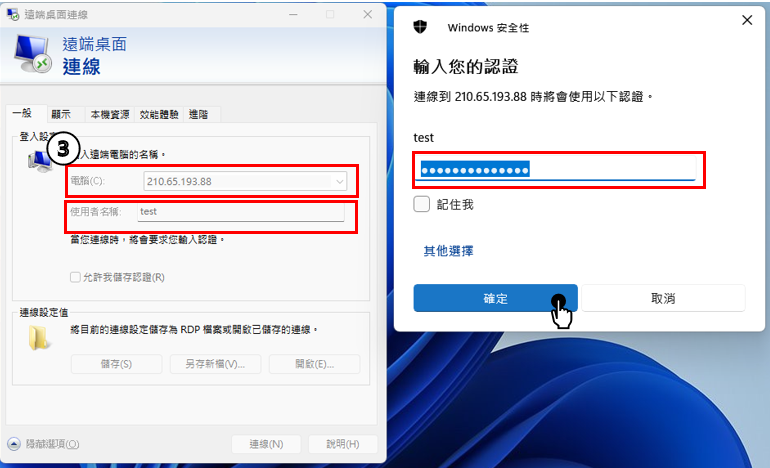

---
layout:
  title:
    visible: true
  description:
    visible: false
  tableOfContents:
    visible: true
  outline:
    visible: false
  pagination:
    visible: true
---

# 🖥️ HiNet jump server

Jump server  Instruction

#### This document primarily introduces the usage of the jump server.

&#x20; (1).Plantynet have the usage of a jump server for system maintenance to facilitate platform  switching   (fixed network/mobile network) or to use other maintenance-related jump servers.&#x20;

&#x20; (2).The required password may vary depending on the specific jump server being used.

&#x20; (3).To save time on password retrieval, we will directly provide the passwords for easier login.

&#x20; (4).We will first introduce the fixed network side before discussing the mobile network side.

## 1. Connection operation of the HiNet jump server.

&#x20;  (1).First, click on the bottom-left corner of the desktop,&#x20;

&#x20;  (2).then click on Remote Desktop Connection = 遠端桌面連線

<figure><figcaption>
Picture-1  Remote Desktop Connection
</figcaption></figure>

(3).After selecting the jump server for (210.65.193.88).

&#x20;     Enter the Computer & User Name & password to establish the connection."

&#x20;       \-> 電腦(C):210.65.193.88 &#x20;

&#x20;       \-> 使用者名稱:test&#x20;

&#x20;       \-> Password: dornrehdfh@WSX     &#x20;

<figure><figcaption>
Picture-2  Remote Desktop Connection(210.65.193.88)
</figcaption></figure>

(4).Please enter the one-time password according to the account used and connect,

&#x20;     following the sequence below the picture.

<figure><figcaption>
Picture-3  PulseSecure-1
</figcaption></figure>

(5).You will first see the 'connecting' image in the first picture.&#x20;

&#x20;     Click 'Retry'=重試(R) in the second picture to enter the loading state of the third picture&#x20;

<figure><figcaption>
Picture-4  PulseSecure-2
</figcaption></figure>

(6). After connect to PulseSecure, then click the Remote Desktop shortcut for RDP\_跳板機 on the desktop.

<figure><figcaption>
Picture-5  RDP_跳板機
</figcaption></figure>

(7).Click 'OK' = 確定 to indicate your willingness to comply with the usage policy.

<figure><figcaption>
Picture-6  usage policy
</figcaption></figure>

(8).Click "OK."=確定 This will display the last logged-in user and the time of the last login.

<figure><figcaption>
Picture-7  last time logged-in record
</figcaption></figure>

(9).Successfully accessed the HiNet jump server desktop, and click SecureCRT to enter list.

<figure><figcaption>
Picture-8  HiNet jump server desktop
</figcaption></figure>

<figure><figcaption>
Picture-9  SecurtCRT list
</figcaption></figure>
